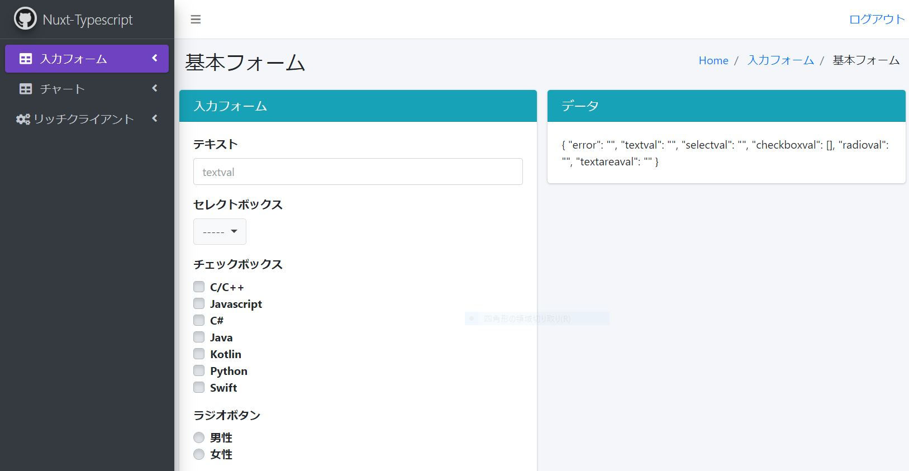

# 🌙 nuxtjs-typescript-boilerplate


====

## 📗 Description

Nuxtjs・Typescript を利用したボイラープレートです。
1. 入力フォーム
2. チャート
3. 画像カルーセル
4. オーバーレイ

### ディレクトリ構造
```
.
├── src (Nuxt関連のソースファイル)
│    ├── @types
│    ├── assets
│    ├── common
│    ├── components
│    ├── interfaces
│    ├── middleware
│    ├── pages
│    ├── plugins
│    ├── static
│    ├── store
│    ├── test
│    └── utilities
├── .babelrc (Babel設定ファイル)
├── .vscode (VSCode設定ファイル)
├── jest.config.js
├── nuxt.config.ts
├── package.json
├── tools (サーバー起動用モジュール)
└── tsconfig.json
```

## 🖊️ VS. 

### 利用している技術
- Nuxtjs 2.12.2
- Typescript
- ESLint
- Jest
- VueChart
- AdminLTE3

## 🌐 Demo



https://demo.isystk.com/nuxtjs/

## 🎨 Requirement

推奨するNodeのバージョン v13.13.0

## 💬 Usage

```bash
$ cd /path/to/nuxtjs-typescript-boilerplate
# run server
$ node ./tools/server.js
# run client
$ yarn run dev
```

#### 接続先情報
##### テストユーザー test@sample.com / password

| 接続先| URL|
| :-----| :---------------------------------------|
| DEMO画面| http://localhost:3000/|

## 📦 Install

```bash
$ cd /path/to/nuxtjs-typescript-boilerplate
# node inistall
$ nodebrew install v13.13.0
# yarn inistall
$ node install -g yarn
# module inistall
$ yarn
```

## 🔧 Contribution

1. Fork it ( http://github.com/isystk/nuxtjs-typescript-boilerplate/fork )
2. Create your feature branch (git checkout -b my-new-feature)
3. Commit your changes (git commit -am 'Add some feature')
4. Push to the branch (git push origin my-new-feature)
5. Create new Pull Request

## 🔗 参考

| プロジェクト| 概要|
| :---------------------------------------| :-------------------------------|
| [公式ドキュメント - Nuxt.js](https://ja.nuxtjs.org/guide/)| 公式ドキュメント - Nuxt.js|
| [公式ドキュメント - TypeScript](https://www.typescriptlang.org/docs/home)| 公式ドキュメント - TypeScript|
| [仕事ですぐに使えるTypeScript](https://future-architect.github.io/typescript-guide/)| 仕事ですぐに使えるTypeScript|
| [AdminLTE Docs](https://adminlte.io/docs/2.4/installation)| AdminLTE Docs|
| [Bootstrap4 日本語リファレンス](https://getbootstrap.jp/docs/4.4/getting-started/introduction/)| Bootstrap4 日本語リファレンス|
| [アイコン（fontawesome）](https://fontawesome.com/icons?d=gallery)| アイコン（fontawesome）|

## 🎫 Licence

[MIT](https://github.com/isystk/nuxtjs-typescript-boilerplate/blob/master/LICENSE)

## 👀 Author

[isystk](https://github.com/isystk)
